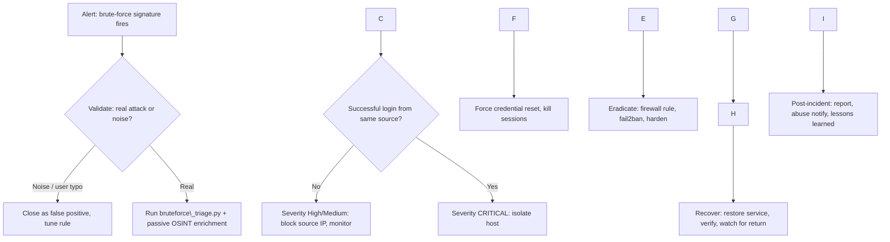

# SOC Playbook — SSH / RDP Brute-Force Attack

**Incident Response Playbook — Remote Authentication Brute Force**

|Field|Value|
|-|-|
|**Document ID**|SAFEX-SOC-PB-002|
|**Version**|1.0|
|**Classification**|Internal — SafeX Solutions / Client SOC Use|
|**Incident Type**|Credential Access → Brute Force (SSH \& RDP)|
|**Author**|Muhammad umair, BS Cybersecurity, Air University (NCC)|
|**Programme**|SafeX Solutions Blue Team — Defensive Exercise, Week 2 (Individual)|
|**Group**|Group 17|
|**Framework Alignment**|NIST SP 800-61r2 (IR Lifecycle) · MITRE ATT\&CK · CVSS v3.1|
|**Date**|2026-01|
|**Review Cycle**|Quarterly, or after any P1/P2 brute-force incident|

> \*\*Integration note (Group 17):\*\* This module is the \*SSH/RDP Brute Force\*
> response procedure. It is deliberately scoped to remote-authentication
> credential attacks so it does not overlap with the group's phishing,
> malware, web-attack, or OSINT-audit modules. It consumes the same detection
> stack (Wazuh/Suricata) documented in the group's Week 1 environment build.

\---

## 1\. Purpose

This playbook gives SOC Tier 1 and Tier 2 analysts a repeatable, auditable
procedure to **detect, triage, contain, eradicate, and recover from**
brute-force and password-spraying attacks against remote authentication
services — primarily OpenSSH (TCP/22) and Windows RDP (TCP/3389).

The goal is consistent decisions under time pressure: the same alert should
produce the same response regardless of which analyst is on shift.

## 2\. Scope

**In scope:** interactive login brute force / password spraying / credential
stuffing against SSH and RDP on internal, DMZ, and internet-facing hosts;
detection of a *successful* login following a failure burst (credential
compromise).

**Out of scope:** application-layer brute force (web login forms — covered by
the web-attack module), VPN/IPSec brute force (separate playbook),
Kerberoasting/AS-REP roasting (AD credential-theft playbook).

## 3\. Roles \& Responsibilities (RACI)

|Activity|T1 Analyst|T2 Analyst|SOC Lead|System Owner|IR Manager|
|-|-|-|-|-|-|
|Alert validation / triage|**R**|C|I|I|I|
|OSINT enrichment of source IP|**R**|C|I|-|-|
|Severity assignment|R|**A**|C|I|I|
|Containment (block/isolate)|C|**R**|A|C|I|
|Credential reset / eradication|I|C|A|**R**|I|
|Executive / client notification|I|I|**R**|I|A|
|Post-incident review|C|R|**A**|C|R|

*R = Responsible, A = Accountable, C = Consulted, I = Informed*

## 4\. Detection Sources \& Signatures

|Source|Signal|Event / Rule|
|-|-|-|
|Linux OpenSSH|Failed password / invalid user|`auth.log` → Wazuh rule 5710/5712/5716/5720|
|Windows RDP|Failed logon, LogonType 10|Security **4625** (Status 0xC000006A/0x64)|
|Windows RDP|Successful remote logon|Security **4624**, LogonType 10|
|Suricata IDS|High connection rate to 22/3389|Custom threshold rule (see `detection/suricata/`)|
|Wazuh correlation|N failures in window from one src|Composite alert → escalate to this playbook|

Detection thresholds used by the triage tool (tunable — Appendix B):
`≥ 5 failures` from a single source within a **5-minute** window flags a
brute-force candidate; **any successful login preceded by a failure burst**
from the same source is treated as a probable compromise.

> \*\*Detection gap to remember:\*\* \*low-and-slow\* spraying (e.g. 1 attempt every
> 40 min) stays under burst thresholds. Mitigate with a second, longer-window
> correlation rule (Appendix B) and account-based (not just IP-based) counting.

## 5\. MITRE ATT\&CK Mapping

|Technique|ID|Where it appears|
|-|-|-|
|Brute Force|**T1110**|Repeated failed auth from one source|
|Password Guessing|T1110.001|Many usernames, few passwords each|
|Password Spraying|T1110.003|Few passwords across many accounts|
|Credential Stuffing|T1110.004|Leaked credential pairs replayed|
|Valid Accounts|**T1078**|Success after failure burst = live creds|
|External Remote Services|T1133|SSH/RDP exposed to the internet|

## 6\. Severity / Triage Matrix

|Severity|Criteria|Target Response (SLA)|
|-|-|-|
|**Critical (P1)**|Successful login after failure burst; privileged account (`root`/`Administrator`) compromised; internet-facing host|Contain **≤ 15 min**|
|**High (P2)**|Sustained brute force (high volume/burst) against exposed host, no success yet; source flagged scanner/compromised by OSINT|Respond **≤ 30 min**|
|**Medium (P3)**|Persistent low-volume attempts; internal/DMZ host; no privileged target|Respond **≤ 4 h**|
|**Low (P4)**|Isolated failures, likely misconfig or user typo; internal source|Review **≤ 24 h**|

The `bruteforce\_triage.py` tool computes this severity automatically from
failure count, burst tightness, username diversity, privileged-account
targeting, success flag, and OSINT reputation.

\---

## 7\. Response Procedure (NIST SP 800-61r2 Lifecycle)



### Phase 1 — Preparation *(before the incident)*

* Ensure SSH/RDP auth logs ship to the SIEM (Wazuh) with < 5 min latency.
* Baseline normal login sources, hours, and accounts per host.
* Confirm edge firewall and host firewall (`iptables`/Windows FW) support
rapid IP blocking; pre-stage a block list / SOAR action.
* Deploy `fail2ban` (SSH) and RDP account-lockout GPO as preventive controls.
* Keep an updated asset inventory (which hosts expose 22/3389, and to whom).
* Have this playbook, the triage tool, and analyst OSINT access ready.

### Phase 2 — Detection \& Analysis

1. **Acknowledge** the alert in the ticketing system; record start time.
2. **Collect** the relevant log slice:

   * Linux: `grep sshd /var/log/auth.log` (or pull from SIEM).
   * Windows: filter Security log for **4625** + **4624** (LogonType 10).
3. **Triage with the tool** to structure the evidence:

```bash
   python3 src/bruteforce\_triage.py --authlog /var/log/auth.log \\
       --json out.json --md out.md
   ```

   It aggregates per source IP, counts failures/burst, lists targeted users,
flags any success-after-failure, and tags MITRE techniques.

4. **Passive OSINT enrichment** of each offending source IP *(no active
scanning of the attacker — passive only):*

   * **WHOIS / RDAP** → owning ASN/org, allocated netblock, country, and the
**abuse contact** used later for responsible reporting.
   * **Shodan (host view)** → already-indexed open ports, tags such as
`scanner`/`compromised`, and last-seen date — helps distinguish a random
scanner from a targeted actor or a compromised relay.
   * **crt.sh (Certificate Transparency)** → if the source reverse-resolves to
a hostname, pivot on the parent domain to reveal related certs/subdomains
and expose shared attacker infrastructure.
5. **Determine severity** using §6 and the tool's score. Key question:
*did any authentication succeed from the attacking source?*
6. **Scope** the blast radius: which host(s), which account(s), which
services. Check whether the same source hit other assets.

### Phase 3 — Containment

*Analyst-approved actions — the tool never blocks automatically.*

* **No success yet (High/Medium):**

  * Block the source IP at the **edge firewall** (and host firewall).

    * Linux: `iptables -I INPUT -s <IP> -j DROP`
    * Windows: `New-NetFirewallRule -Direction Inbound -RemoteAddress <IP> -Action Block`
  * If the whole netblock is hostile per WHOIS, consider a CIDR block.
  * Verify `fail2ban`/lockout is active; tighten window if needed.
* **Successful login present (Critical):**

  * **Isolate the affected host** from the network (or restrict to admin VLAN).
  * **Kill the attacker's active sessions** (`who` / `pkill -KILL -u <user>`;
RDP: log off the session, disable the account).
  * Preserve volatile evidence first where feasible (session list, `last`,
process list, established connections).


\# Passive OSINT Investigation


During the investigation, passive OSINT techniques were used to validate infrastructure related to the incident.


\## WHOIS


Command


whois safexsolutions.com


Purpose


Identify domain registration information.


\---


\## DNS Enumeration


Commands


nslookup safexsolutions.com


dig safexsolutions.com


Purpose


Identify IP addresses and DNS records.


\---


\## Certificate Transparency


Tool


crt.sh


Purpose


Identify SSL certificates issued for the domain.


\---


\## Shodan


Target IP


145.79.24.115


Purpose


Identify publicly exposed services.


Result


HTTPS (443) was identified.


\---


\## SSL Verification


Command


echo | openssl s\_client -connect safexsolutions.com:443 2>/dev/null | openssl x509 -noout -issuer -subject -dates


Purpose


Verify SSL certificate validity.


### Phase 4 — Eradication

* Force **password reset** for every account the source touched (and any
successfully accessed account), and rotate keys/tokens that account held.
* Remove any persistence the attacker may have added (new users, authorized
keys, scheduled tasks, services) — hunt using ATT\&CK T1136/T1053 checks.
* Patch/harden the exposed service:

  * SSH: disable password auth (`PasswordAuthentication no`), key-only,
disable root login, move behind bastion/VPN, restrict `AllowUsers`.
  * RDP: enforce NLA, MFA, network-level exposure removal, restrict via GPO.
* Confirm the source IP block and any lockout policies remain in effect.

### Phase 5 — Recovery

* Restore the host/account to service after validation (clean scan, reviewed
logs, confirmed no persistence).
* **Heightened monitoring** for 24–72 h: watch for the same source returning
from a new IP in the same ASN, and for lateral-movement signals from any
compromised account.
* Verify hardening is effective (attempt a benign login test per policy).

### Phase 6 — Post-Incident Activity

* Complete the incident report (timeline, IOCs, actions, root cause).
* **Responsible disclosure / abuse reporting:** notify the source's abuse
contact (from WHOIS) and, where relevant, the hosting provider — factual,
evidence-backed, no active retaliation.
* Feed IOCs (source IPs, ASNs, targeted usernames) into blocklists/threat
intel.
* **Lessons learned:** was the service exposed unnecessarily? Were thresholds
right? Update detection rules and this playbook. Record metrics (§8).

\---

## 8\. Metrics \& KPIs

|Metric|Definition|Target|
|-|-|-|
|MTTD|Alert time − first attack event|< 5 min|
|MTTA|Analyst ack − alert time|< 10 min|
|MTTC|Containment − validation|P1 < 15 min|
|False-positive rate|FP alerts ÷ total brute-force alerts|< 15%|
|Compromise catch rate|Detected success-after-burst ÷ actual|≥ 95%|

## 9\. Communication Plan

|Trigger|Notify|Channel|
|-|-|-|
|P3/P4 opened|SOC Lead (shift log)|Ticket|
|P1/P2 confirmed|SOC Lead + System Owner + IR Manager|Call + ticket|
|Confirmed compromise (P1)|+ Client/PTCL point of contact|Formal notification|
|Post-incident|All stakeholders|Report + review meeting|

\---

## Appendix A — Quick Command Reference

```bash
# Linux: top offending SSH source IPs
grep "Failed password" /var/log/auth.log | \\
  grep -oE "from \[0-9.]+" | sort | uniq -c | sort -rn | head

# Did any of them ever succeed?
grep "Accepted" /var/log/auth.log | grep -E "203.0.113.45"

# Active sessions on a possibly-compromised host
who; last -a | head; ss -tnp state established

# Windows (PowerShell): failed RDP logons by source
Get-WinEvent -FilterHashtable @{LogName='Security';Id=4625} |
  Where-Object {$\_.Properties\[10].Value -eq 10} |
  Group-Object {$\_.Properties\[19].Value} | Sort-Object Count -Descending
```

## Appendix B — Detection Tuning

|Parameter|Default|Notes|
|-|-|-|
|`FAIL\_THRESHOLD`|5|Min failures per source to flag|
|`WINDOW\_SECONDS`|300|Burst window (raise a 2nd rule to \~24h for low-and-slow)|
|`DISTINCT\_USER\_HINT`|3|≥3 usernames ⇒ spray/dictionary flavour|

Second correlation rule (low-and-slow): count failures **per targeted account
across all sources** over a 24 h window; alert on account lockouts spikes.

## Appendix C — References

* NIST SP 800-61r2, *Computer Security Incident Handling Guide*.
* MITRE ATT\&CK: T1110, T1110.001/.003/.004, T1078, T1133.
* CIS Controls v8: 4 (Secure Config), 6 (Access Mgmt), 8 (Audit Logs).
* OpenSSH `sshd\_config`, Microsoft RDP/NLA hardening guidance.

